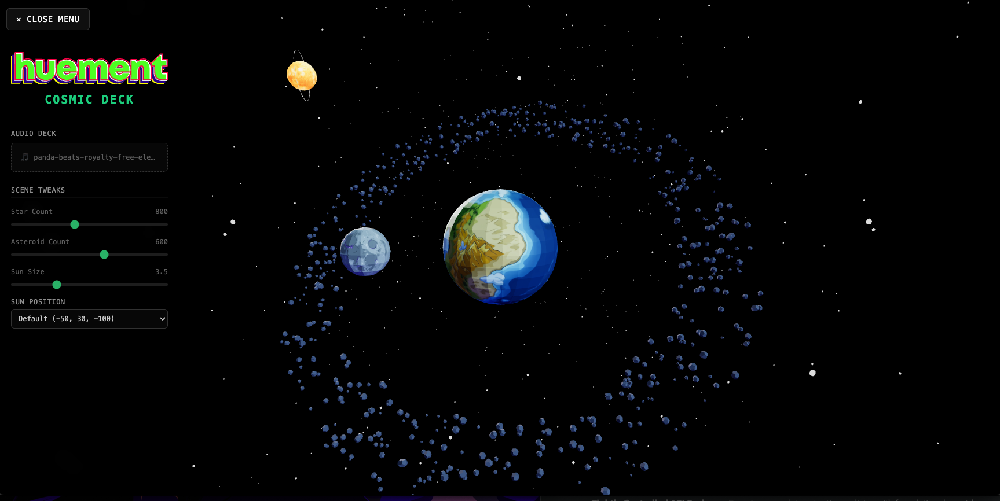

<div align="center">
  <h1>🚀☀️ VIVE-WORLD 🌏🪐</h1>
  <p>
    
    
    
  </p>
</div>



A retro-futuristic, low-poly 3D cosmic simulator and visualizer built with **React**, **Three.js (React Three Fiber)**, and **Tailwind CSS v4**. Experience a stylized celestial ecosystem featuring an active asteroid belt, a blazing self-illuminated star, and a responsive glassmorphic command deck.

## 🌟 Core Features

- **Geometric Low-Poly Aesthetic:** Implements flat shading across crystalline geometries, turning standard spheres and shapes into beautifully faceted retro-indie assets.
- **Emissive Star Mapping:** The distant sun leverages high-contrast plasma texturing fed directly into an emissive mapping material shader, cranking up the glow intensity to deliver an intense, self-illuminated solar look.
- **Dual-Plane Orbital System:** Simulates realistic spatial scale by separating orbital planes; the moon maintains a flat equatorial orbit, while a sprawling belt of hundreds of unique asteroids cuts through the scene at a sharp $45^\circ$ angle.
- **Cinematic Lighting Rig:** Replaces flat environments with a multi-directional light setup. A primary sun key-light streams from deep space, a soft nebula fill light handles front-facing readability, and a two-tone hemisphere light drives rich blue/purple shadow gradients.
- **Glassmorphic "Cosmic Deck" UI:** A sleek, frosted slide-out menu built using the modern **Tailwind CSS v4 Vite plugin architecture** for real-time simulation adjustments.
- **Smart Target Lock Camera:** A custom mathematical camera controller mapping inputs to spherical coordinates, enabling total freedom of movement while ensuring the lens stays permanently locked on the Earth's center point.

## ⠀🛠️ Technical Engineering Highlights

### ⚡ GPU Performance Optimization

Instead of overloading the CPU by spawning thousands of individual mesh components, the starfield and asteroid belt leverage **instancedMesh**. This renders thousands of moving elements within a single draw call directly on the GPU.
⚠️ **The WebGL Count Trap:** WebGL requires a fixed GPU buffer allocation when setting up instanced elements. To safely modify counts at runtime without breaking performance, components are mounted using explicit React state key properties (e.g., key={controls.asteroidCount}). This forces a clean, lightning-fast GPU memory reconstruction whenever density sliders shift.

### 🔒 Strict State & Module Isolation

Engineered to completely support **Vite Fast Refresh (HMR)** and strict verbatimModuleSyntax TypeScript compilation. Global simulation parameters are separated into a pure data layer (SceneContext.ts) and a pure UI layer (SceneProvider.tsx), removing cross-contamination and rendering warnings entirely.

## 📂 Architecture & File Structure

```bash
src/
├── assets/                  # High-contrast space textures & SVG vector logos
├── components/
│   ├── AsteroidRing.tsx     # Instanced Mesh belt using custom deterministic PRNG seeds
│   ├── HiddenMenu.tsx       # Frosted glass sidebar panel utilizing Tailwind CSS v4
│   ├── Planet.tsx           # Flat-shaded low-poly Earth and orbiting Moon system
│   ├── SmartCameraControls.tsx # Custom keyboard/mouse camera coordinator
│   ├── Starfield.tsx        # High-performance instanced background warp field
│   └── Sun.tsx              # Emissive plasma core mesh with vector ring halo
├── SceneContext.ts          # Type-safe global simulation control hook declarations
├── SceneProvider.tsx        # Context provider anchoring initial scene metrics
├── App.tsx                  # Master Canvas pipeline layer & lighting stage setup
├── main.tsx                 # Strict root rendering entry point
└── index.css                # Global CSS containing Tailwind v4 directives
```

## 🎮 Simulation Controls

Open the **☰ Controls** deck from the top-left corner to tweak environmental parameters via sliders, or navigate the viewport directly using your mouse and keyboard:

### 🖱️ Mouse Inputs

- **Left Click + Drag:** Orbit around the Earth.
- **Scroll Wheel:** Zoom smoothly in toward the atmosphere or pull back out into deep space.

### ⌨️ Keyboard Inputs

| **Key Command** | **Action Performed**  |
| --------------- | --------------------- |
| W / Arrow Up    | Orbit camera upward   |
| S / Arrow Down  | Orbit camera downward |
| A / Arrow Left  | Orbit camera left     |
| D / Arrow Right | Orbit camera right    |
| Q               | Rapid zoom in         |
| E               | Rapid zoom out        |

## 🚀 Future Roadmap: Audio Integration

The internal state model is structurally optimized to support a future **Music Visualizer Expansion**. The global context context hooks are prepared to ingest dynamic frequency arrays, unlocking features like:

- **Solar Flare Pulse:** Mapping treble frequencies to drive the Sun’s emissiveIntensity and geometry scale.
- **Asteroid Waveform:** Passing bass amplitudes into the asteroid positioning loop to translate the ring into a fluid, swirling physical audio visualizer waveform.
